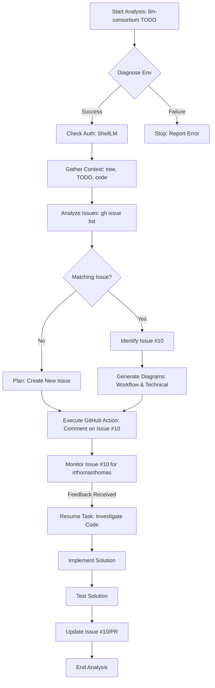

```mermaid
graph TD
    A[Start Analysis: llm-consortium TODO] --> B{Diagnose Env};
    B -- Success --> C[Check Auth: ShellLM];
    B -- Failure --> Z[Stop: Report Error];
    C --> D[Gather Context: tree, TODO, code];
    D --> E[Analyze Issues: gh issue list];
    E --> F{Matching Issue?};
    F -- Yes --> G[Identify Issue #10];
    F -- No --> H[Plan: Create New Issue]; H --> J;
    G --> I[Generate Diagrams: Workflow & Technical];
    I --> J[Execute GitHub Action: Comment on Issue #10];
    J --> K[Monitor Issue #10 for irthomasthomas];
    K -- Feedback Received --> L[Resume Task: Investigate Code];
    L --> M[Implement Solution];
    M --> N[Test Solution];
    N --> O[Update Issue #10/PR];
    O --> P[End Analysis];
```
