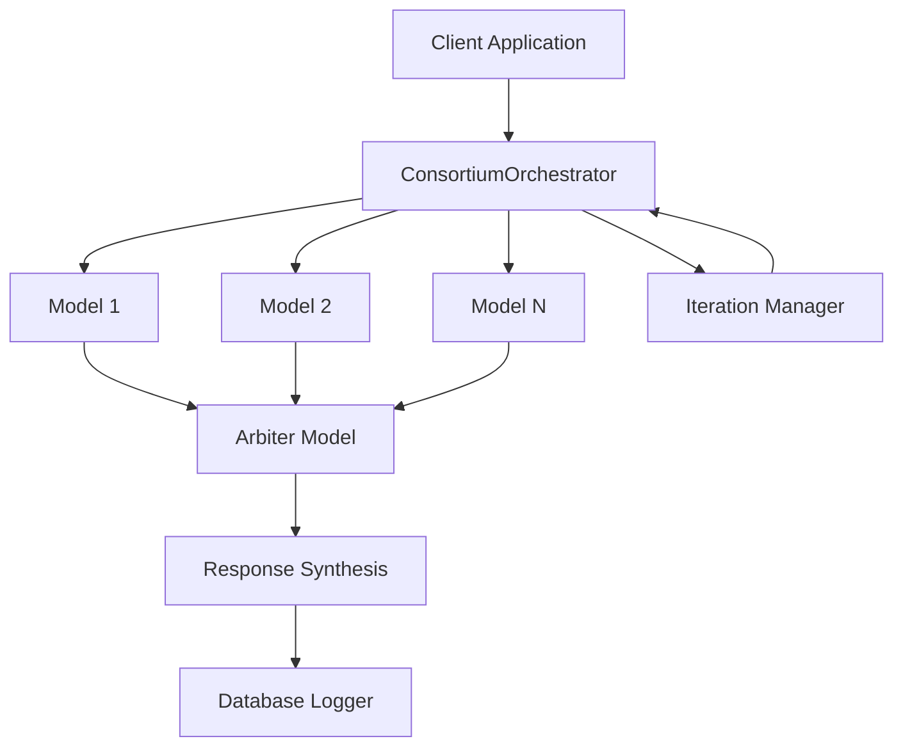
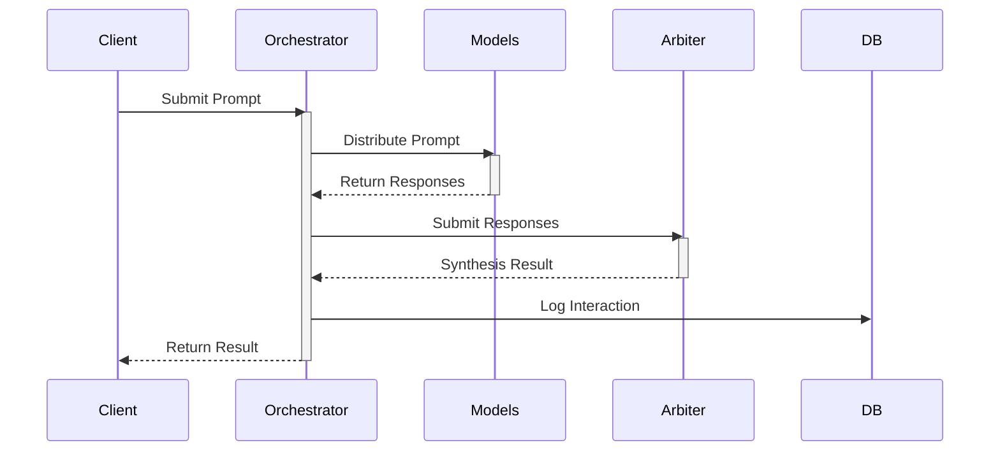
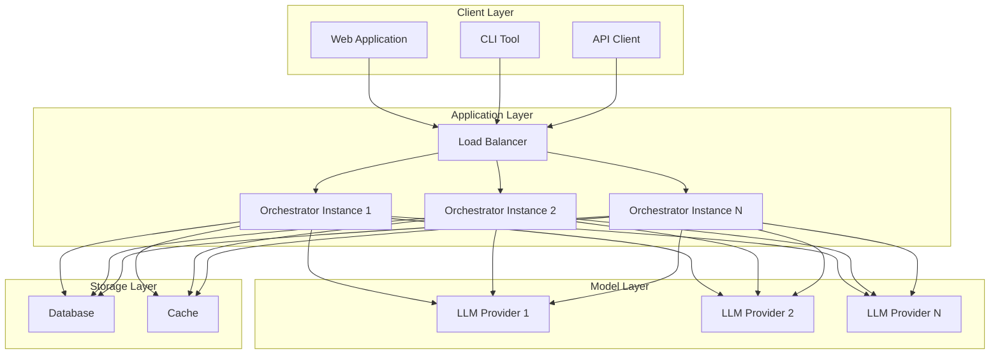
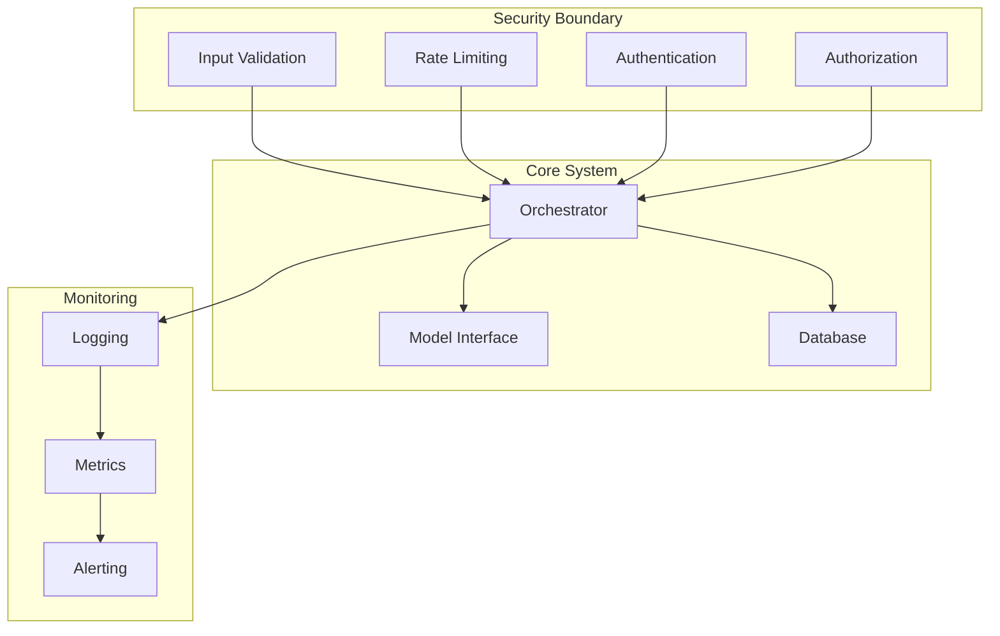

# Architecture Overview

## System Components

## Data Flow

## Component Responsibilities

### ConsortiumOrchestrator
- Manages model interactions
- Controls iteration flow
- Handles response synthesis
- Manages confidence thresholds

### Model Interface
- Standardizes model interactions
- Handles API communication
- Manages model-specific formatting
- Implements retry logic

### Arbiter
- Evaluates model responses
- Synthesizes final output
- Determines confidence levels
- Identifies refinement needs

### Database Logger
- Records interactions
- Stores response history
- Manages performance metrics
- Handles error logging

### Iteration Manager
- Controls refinement cycles
- Manages iteration state
- Implements stopping criteria
- Optimizes prompts

## Deployment Architecture

## Security Architecture

