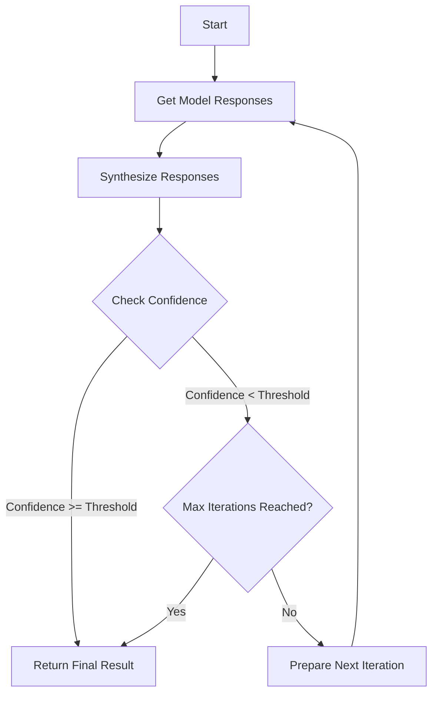

# LLM Consortium

## Inspiration

Based on Karpathy's observation:

"I find that recently I end up using all of the models and all the time. One aspect is the curiosity of who gets what, but the other is that for a lot of problems they have this "NP Complete" nature to them, where coming up with a solution is significantly harder than verifying a candidate solution. So your best performance will come from just asking all the models, and then getting them to come to a consensus."

A plugin for the `llm` package that implements a model consortium system with iterative refinement and response synthesis. This plugin orchestrates multiple learned language models to collaboratively solve complex problems through structured dialogue, evaluation and arbitration.

## Core Algorithm Flow

The following Mermaid diagram illustrates the core algorithm flow of the LLM Karpathy Consortium:



## Features

- **Multi-Model Orchestration**: Coordinate responses from multiple LLMs simultaneously
- **Iterative Refinement**: Automatically refine responses through multiple rounds until confidence threshold is met
- **Advanced Arbitration**: Uses a designated arbiter model to synthesize and evaluate responses
- **Database Logging**: Built-in SQLite logging of all interactions and responses
- **Configurable Parameters**: Adjustable confidence thresholds, iteration limits, and model selection
- **Hundreds of Models**: Supports all models available via llm plugins
- **Save and Load Consortium Configurations**: Save your favorite model configurations to reuse later.

## Installation
First, get https://github.com/simonw/llm

uv:
```bash
uv tool install llm
```
pipx:
```bash
pipx install llm
```

```bash
llm install llm-consortium
```

## Command Line Usage

The `consortium` command now defaults to the `run` subcommand, allowing for more concise usage.

Basic usage:
```bash
llm consortium "What are the key considerations for AGI safety?"
```

This will:

1. Send the prompt to multiple models in parallel.
2. Gather responses including reasoning and confidence.
3. Use an arbiter model to synthesize the responses and identify key points of agreement/disagreement.
4. The arbiter model evaluates confidence.
5. If confidence is below the threshold and the maximum iterations have not been reached:
   - Refinement areas are identified.
   - A new iteration begins with an enhanced prompt.
6. The process continues until the confidence threshold is met or the maximum iterations have been reached.

### Options

- `-m, --models`: Models to include in consortium (can specify multiple). Defaults to `claude-3-opus-20240229`, `claude-3-sonnet-20240229`, `gpt-4`, and `gemini-pro`.
- `--arbiter`: Model to use as arbiter (default: `claude-3-opus-20240229`).
- `--confidence-threshold`: Minimum confidence threshold (default: `0.8`).
- `--max-iterations`: Maximum number of iteration rounds (default: `3`).
- `--system`: Custom system prompt.
- `--output`: Save full results to a JSON file.
- `--stdin`/`--no-stdin`: Read additional input from stdin and append to prompt (default: enabled).
- `--raw`: Output raw response from arbiter model and individual model responses (default: enabled).

Advanced usage with options:
```bash
llm consortium "Your complex query" \
  --models claude-3-opus-20240229 \
  --models claude-3-sonnet-20240229 \
  --models gpt-4 \
  --models gemini-pro \
  --arbiter claude-3-opus-20240229 \
  --confidence-threshold 0.8 \
  --max-iterations 3 \
  --output results.json
```

### Managing Consortium Configurations
The `consortium` command also provides subcommands for managing configurations:

#### Saving a Consortium as a model
```bash
llm consortium save my-consortium \
    --models claude-3-opus-20240229 \
    --models gpt-4 \
    --arbiter claude-3-opus-20240229 \
    --confidence-threshold 0.9 \
    --max-iterations 5
```
This command saves the current configuration as a model with the name `my-consortium`.

```bash
llm -m my-consortium "What are the key considerations for AGI safety?"
```


#### Listing Saved Configurations
```bash
llm consortium list
```
This command displays all available saved consortium configurations.

#### Showing a Configuration
```bash
llm consortium show my-consortium
```
This command shows the details of a saved consortium named `my-consortium`.

#### Removing a Configuration
```bash
llm consortium remove my-consortium
```
This command removes the saved consortium named `my-consortium`.

### Response Structure

The plugin uses a structured XML format for responses, including the synthesis, analysis, confidence and, if present, dissenting views.

```xml
<synthesis>
[Synthesized response to the query]
</synthesis>

<confidence>
[Confidence level from 0 to 1]
</confidence>

<analysis>
[Analysis of the model responses, synthesis reasoning, and identification of key points of agreement or disagreement]
</analysis>

<dissent>
[Notable dissenting views and refinement areas]
</dissent>
```

### Database Logging

All interactions are automatically logged to a SQLite database located in the LLM user directory.

## Programmatic Usage

```python
from llm_consortium import ConsortiumOrchestrator

orchestrator = ConsortiumOrchestrator(
    models=["claude-3-opus-20240229", "gpt-4", "gemini-pro"],
    confidence_threshold=0.8,
    max_iterations=3,
    arbiter="claude-3-opus-20240229"
)

result = await orchestrator.orchestrate("Your prompt")

print(f"Synthesized Response: {result['synthesis']['synthesis']}")
print(f"Confidence: {result['synthesis']['confidence']}")
print(f"Analysis: {result['synthesis']['analysis']}")
```

## License

MIT License

## Credits

Developed as part of the LLM ecosystem, inspired by Andrej Karpathy's work on model collaboration and iteration.